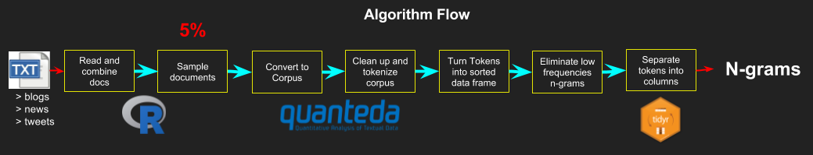
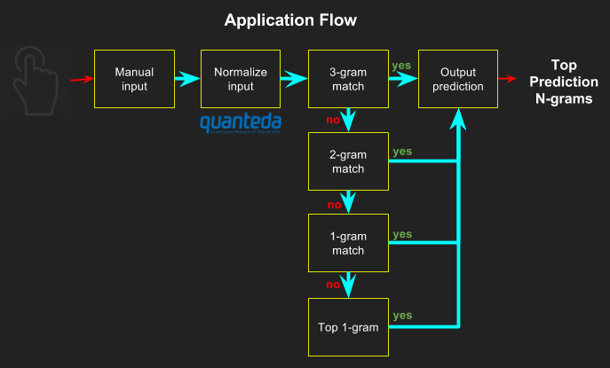

## Next Word Prediction

### The project

This is an usable public data product in the area of natural language processing.

### The data

The data is comprised of texts extracted from news, blogs and tweets in English. The corpora was comprised of **4.26
million lines** and **102.4 million words** in **799.5 Mbs**.

### Procesing the data

Below, there is a visualization of how I processed the data to feed the prediction algorithm.

### The application

The application predicts the next word based on N-gram "Stupid Backoff" model
algorithm ([Brants et al 2007](http://www.cs.columbia.edu/~smaskey/CS6998-0412/supportmaterial/langmodel_mapreduce.pdf)).

Below, there is a visualization of how the application works.

### Text Area

Enter the sentence without the final word to be predicted. `Text` allows copy and paste. Text is not case sensitive.

### Next word prediction

Displays the top 3 most likely words predicted.